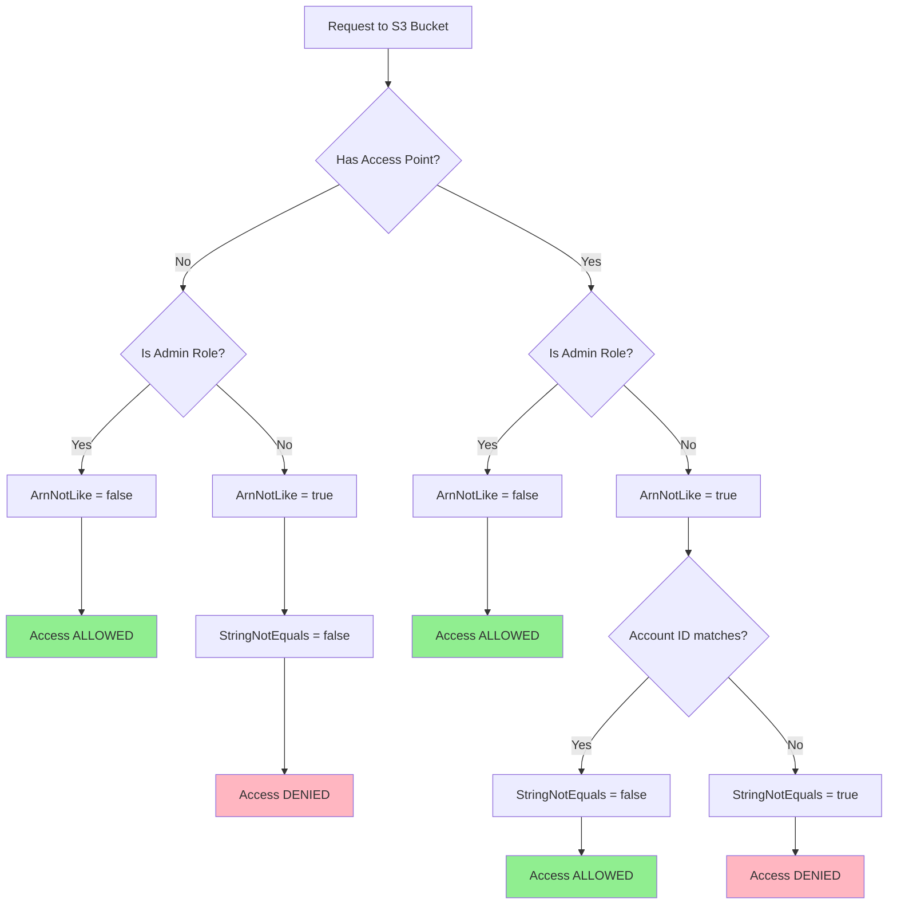

# Test a role for S3 access

Idea is given a role, assert it meets its requirements.

# Two Layers of Policies:

Access Point Policy: This is a resource-based policy attached directly to the access point. It defines what actions are allowed through that specific access point and by which principals. In your case, your access point policy correctly allows a_role to ListBucket on the access point and GetObject on foo/* objects via the access point.
IAM Role Policy (Identity-based Policy): This policy is attached to the IAM role (a_role). It defines what actions the role is permitted to perform across AWS. Crucially, even when using an access point, the role still needs permission to act on the underlying S3 bucket resources.

# Why Both?

The access point policy acts as a gate for the access point itself.
The IAM role policy ensures the role has the fundamental permissions to interact with S3 bucket resources. The Condition using s3:DataAccessPointArn in the role's policy is the key: it restricts the role's S3 bucket permissions to only be effective when the request is made through that specific access point. This prevents the role from, for example, using its s3:GetObject permission on the bucket directly if you only want it to go through the access point.

The "Replication" in a_role_access_point_readonly: You're right that the aws_iam_role_policy.a_role_access_point_readonly policy looks somewhat similar to what the access point policy achieves regarding the foo/* path. This is because the role policy needs to explicitly grant permission to s3:ListBucket on the bucket (conditioned by the AP) and s3:GetObject on ${aws_s3_bucket.secure_bucket.arn}/foo/* (also conditioned by the AP).

# Goal: Not touching bucket policy of shared bucket

One of the most significant advantages of using S3 Access Points is the ability to grant specific access to parts of a bucket **without altering the main bucket policy**. This is especially beneficial when:

*   **Sharing a bucket:** Modifying a central bucket policy can be risky and complex, potentially impacting numerous users or applications. Access Points provide isolated access controls.
*   **Delegating access management:** Different teams can manage their own Access Point policies without needing permissions to change the bucket policy.
*   **Bucket policy size limits:** Bucket policies have a 20KB size limit. Access Points help scale access control by distributing policy logic.
*   **Distinct network controls:** You can restrict Access Points to specific VPCs, enabling private network paths to data without changing the bucket policy.

By using Access Points, the bucket policy can remain simpler, focusing on broad rules, while granular permissions are handled by individual Access Point policies. This simplifies management and reduces the risk associated with policy changes.

https://aws.amazon.com/blogs/security/how-to-restrict-amazon-s3-bucket-access-to-a-specific-iam-role/

# Access Point delegate

Two ways:

    s3:DataAccessPointAccount

OR

    Null = {
        "s3:DataAccessPointArn" = "true"
    }

# Policy Decision Tree

The following diagram shows how the bucket policy evaluates requests with and without Access Points:

The policy creates three paths to access:
1. Admin roles (always allowed)
2. Access point with matching account ID (allowed)
3. Everything else (denied)

This ensures that:
- Admin roles maintain access regardless of access point usage
- Non-admin roles must use an access point with matching account ID
- All other access attempts are denied